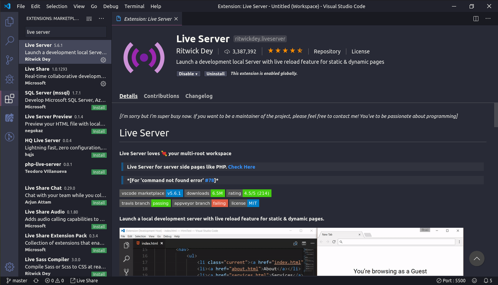
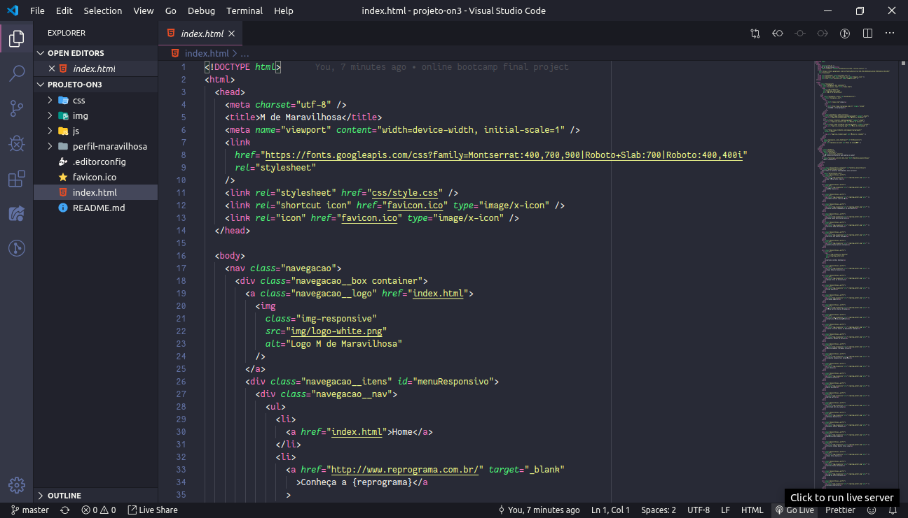

# Projeto M-de-Maravilhosa

Projeto final do Bootcamp Online de Front-end.

## Sobre o projeto

Precisamos falar sobre mulheres que mudaram o mundo!

- [Like a girl](https://youtu.be/XjJQBjWYDTs)
- [Microsoft](https://youtu.be/tNqSzUdYazw)

- Projeto da [turma anterior](https://reprograma.github.io/CursoOnline-Aula8-Projeto/)

## Etapas do projeto

1. Escolha uma personalidade maravilhosa que te inspira.
2. Crie a página de perfil da _Maravilhosa_.
3. Insera na página principal o nome e a foto de sua _Maravilhosa_.
4. Inclua um link para a página do seu perfil (criada no Workshop) ao final da página de perfil da sua _Maravilhosa_.

## Orientações gerais

- Clonar este repositório: `git clone https://github.com/reprograma/On3-projeto-final.git`
- Crie sua branch: `git checkout -b seuNome`, ex: `git checkout -b cintiafumi`
- **Atenção**: Alterar somente em `index.html` onde houver seu nome e colocar o nome de sua personalidade no lugar
- Adicione uma pasta com seu-nome dentro da pasta `perfil-maravilhosa`, ex: _cintia-fumi_
- Dentro da pasta com seu-nome, crie um arquivo html com o nome da personalidade, ex: _ada-lovelace.html_
- Dentro da sua pasta, crie também as pastas de imagens, css e js
- Praticar HTML, CSS, responsividade (_mobile first_), efeitos com JS, JQuery, Bootstrap

### Instalação de extensões no VSCode

- Adicionar a extensão Live Server

- Adicionar a extensão EditorConfig

### Habilitando Live Server

- **VSCode**: habilite o Live Server

- **Git Bash**: verifique seu IP `ip //all`

No navegador do seu celular, digite o `númeroIP:númeroPorta`, ex: `192.168.0.XX:5500`
